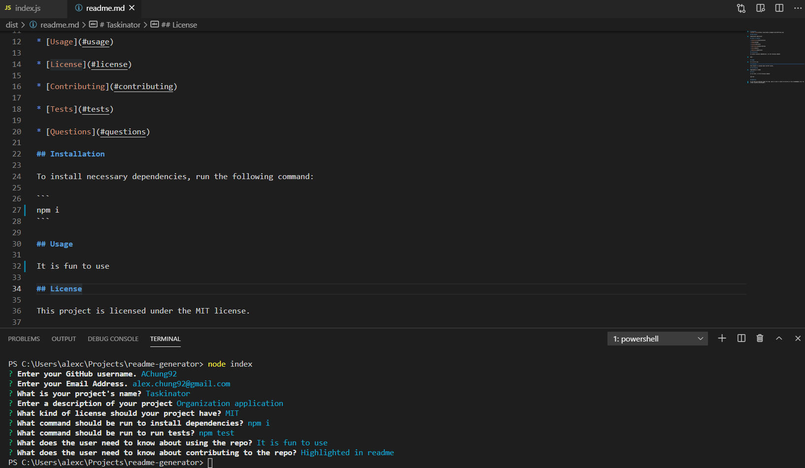

# Readme Generator
Application that generates a readme

## Table of Contents
* Overview
* Technologies
* Status
* Screenshot

## Overview
This is an assignment using Node and JS. The goal of the assignment is to create an app that auto generates a readme file for the user. The below link will guide the user how to use the application.

## Technologies
Project created with:
* Node
* JS

## Status
To view a user guide of my project please visit the below.

[Readme Generator Guide](https://drive.google.com/file/d/1AFC-VhcLg0qm7maXFATtyytzYIfhU3j7/view)

## Screenshot

